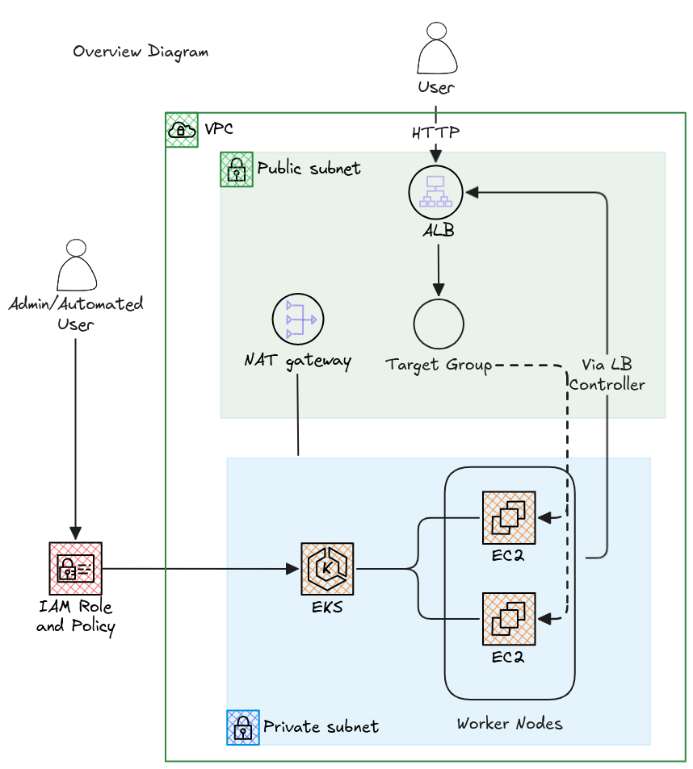
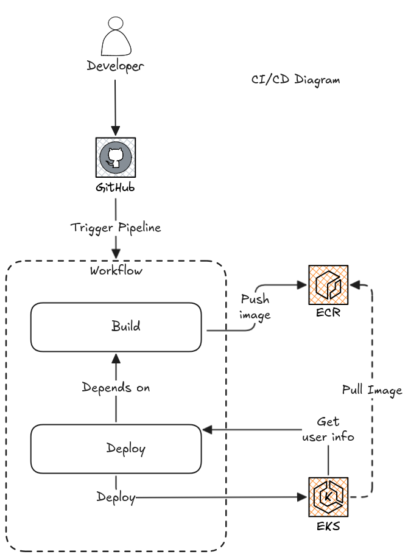

# DevLog

I thought about dividing the problem into 3 parts: API, GitHub Actions CI/CD, and Terraform.



# 1 - API

## API Development and Dockerfile

I decided to use Python to develop the API because it's a language I am familiar with and it's easier for me. Since the API itself will be quite simple, I wanted to use something I know to move faster.

For this, I chose FastAPI and Uvicorn as the API builders.

After that, I wrote the Dockerfile, which basically installs the requirements.txt, copies the files into the image, and finally uses a CMD that by default exposes the API on port 8000 of the container.

## API Manifests

I decided to put the 3 manifests (Deployment, Service, and Ingress) together in the same file to facilitate deployment using GitHub Actions, so I could pass just one `kubectl apply` command and the 3 resources would be applied at once.

Basically, the `manifest-api-deploy.yaml` file contains the description of the deployment, service, and ingress that will be used for the API to function properly.

### Deployment

The main points of attention here are the labels, ports, and the image. I basically defined my API with the name `hello-api` and used the default namespace.

I applied the labels `app: hello-api` on the pod template and also on the Deployment. I used this label to associate the pods with the deployment. Since the application is very simple, I decided to leave just 1 replica. Regarding the ports, since the API inside the image is using port 8000, I had to define the same port to be exposed on the pod `containerPort: 8000`. Finally, I left a `DOCKER_IMAGE` placeholder so that this template could be updated at the time of the image build and retrieve the specific image and tag for that build.

### Service

I defined a `nodePort` type service to ensure that a specific Node port where these pods have been deployed is exposed. Moreover, I ensured I was mapping the request from port `80` to `8000`, with protocol `TCP`. Finally, I had to define the selector as the `app` label that was set in the deployment.

### Ingress

To finalize, I needed to expose this service to the web, for which I used an ingress that would use specific configurations from the [controller (AWS Load Balancer Controller)]((#aws-lb-controller)) I decided to use.

Basically, the configurations are simple, except for the `annotations`, since using the AWS Load Balancer Controller, I have to pass some to configure it correctly. In this case, I wanted the Controller to create an ALB, so I set the following annotations:

- `alb.ingress.kubernetes.io/scheme:` - Defines that the ALB will be public.
- `alb.ingress.kubernetes.io/target-type:` - Specifies how to route traffic to pods.
- `alb.ingress.kubernetes.io/healthcheck-path:` - Defines the path the created target group will use to check the pod's health.

Finally, I just needed to connect the Ingress to the Service on port `80`.

# 2 - Terraform

This step is one of the main steps to be done since the test has specific requirements regarding the cluster infrastructure, that is:

``` md
* Required: 
    * 1 VPC
    * 2 subnets - public and private
    * Security groups as needed
    * 1 EKS cluster, hosted in the private subnet
    * 1 ECR
* Extra:
    * Anything else that you think relevant to this infrastructure
```

So developing the Terraform had to go through these points. As I knew that each of them has its specificity, I looked for modules that would help me create the resources I needed. For this, I used:

- [EKS Terraform Module](#eks) - https://registry.terraform.io/modules/terraform-aws-modules/eks/aws/20.34.0
- [VPC Terraform Module](#vpc) - https://registry.terraform.io/modules/terraform-aws-modules/vpc/aws/5.19.0
- [AWS Load Balancer Controller Module](#aws-lb-controller) - https://github.com/rafaprata/terraform_modules/tree/main/aws/aws_lb_controller

The remaining items among others needed were created using specific providers and resources.

## VPC

One of the bases of the entire flow is the network, so I had to quickly and resiliently create an environment that could help me meet the requirements and complete the test.

Basically, I used the module developed by the AWS team and defined some locals to help modularize the code.

I created a VPC with an IP range of `/16` to ensure an enormous number of IPs for our VPC.

I created 2 private subnets and 2 public subnets within the previously defined IP range. The IP ranges of each subnet are `/24`, which more than suffices for our test scenario, ensuring 254 IPs.

Besides that, it was necessary to add a Nat Gateway so that the Private Subnets could access the internet and thus the Worker Nodes could connect to the Control Plane.

Finally, we defined specific tags related to the [AWS Load Balancer Controller](#aws-lb-controller), which allow the correct association of the subnet to the Load Balancer, as shown in the [AWS Documentation](https://docs.aws.amazon.com/eks/latest/userguide/alb-ingress.html#_prerequisites) and the [Controller Documentation](https://kubernetes-sigs.github.io/aws-load-balancer-controller/v2.1/deploy/subnet_discovery/#subnet-auto-discovery).

Besides these resources created with the module, I created some outside the module that would help me develop the test:

- Internal Access Security Group - For internal communication between resources, I defined this security group that by default allows full access between resources inside the VPC.

## EKS

After defining the base of the VPC, I went on to develop the Kubernetes Cluster. For this, I used the EKS terraform module that helped me in creating the cluster.

I defined the cluster in version `1.31` of Kubernetes, simply because it's the version I use in my day-to-day, and I would feel more comfortable since I am not familiar with the changes in `1.32`. I felt free for this choice since there was no requirement for this.

### Cluster Network

I defined the VPC and Subnets where the cluster would be hosted; in this case, to meet the requirements, we defined the Private Subnets.Regarding the network, I also added 2 directives related to the connection, `cluster_additional_security_group_ids` and `cluster_endpoint_public_access`.

The first adds pre-existing security groups (created outside the module) to the cluster. In this case, I added the Internal Access Security Group, so all resources within the VPC can connect to the cluster.

The second defines whether the cluster's API endpoint is public or not, making it possible to connect to the Control Plane from anywhere if the user has permissions to access the cluster.

### Cluster Compute

I tried to use serverless or managed nodes, but I couldn't. That said, I opted to use self-managed hosts, which for me would work similarly to my experience with ECS, that is, we would have launch templates and auto-scaling groups that control the nodes associated with the cluster.

Since the computational power we need for the nodes is small, I am using by default instances of type `t3.large`, but this could be set as a variable. The same goes for the size, that is, the number of nodes; by default, I am setting 2 and allowing it to scale up to 5. These values are defined for the launch template and auto-scaling.

Besides the computational power, I decided to use the `Amazon Linux 2023` AMI optimized for EKS, as it is an image supported by AWS.

### Cluster Access

One of my biggest challenges was understanding access to the EKS cluster since not only IAM roles are used but a different concept of `Access Entries` and `Access Policies`, as can be seen in the [documentation](https://docs.aws.amazon.com/eks/latest/userguide/grant-k8s-access.html).

I decided to use the authentication mode recommended by AWS EKS API only, which authenticates with the Access Entries.

Basically, two Entries for authentication were defined, being:

- Automated User
    - This entry defines as user an automated user created with Terraform. This user receives two policies, `AdminViewPolicy` and `EditPolicy`.
    - The first allows the user to have view access to all cluster resources since I defined the policy type as `Cluster`. [(Documentation)](https://docs.aws.amazon.com/eks/latest/userguide/access-policy-permissions.html#access-policy-permissions-amazoneksadminviewpolicy)
    - While the second allows the automated user to have edit access only in one namespace of the cluster, as the idea is for this user to be used by the [CI/CD](#3---cicd) only to apply the manifests to the cluster.
- Creator Admin Permissions
  - This entry is automatically defined when we set `enable_cluster_creator_admin_permissions`, so the automated role or user that created the cluster can, after creating the cluster, make changes as an administrator.
  - I had to define this because first, the cluster creation is needed, then add some addons and also associate computational power to the cluster.

## AWS LB Controller

Since our API is a web API, I decided it would be necessary to use an Application Load Balancer to ensure the proper routing of requests to our application's Pod. Mainly considering that our cluster is not publicly available to the Web, we need to have an LB in our Public Subnet that directs the request to the Private Subnet.

For this, the method recommended by AWS is using the [Load Balancer Controller](https://kubernetes-sigs.github.io/aws-load-balancer-controller/v2.12/), which has the function of creating the necessary Elastic Load Balancer resources for the Kubernetes cluster.

My request flow basically consists of an ALB containing the listeners of port 80 or 443 and pointing to a target group that registers the node where the pod is located and the port associated with NodePort, as indicated in the [manifest description](#api-manifests).

To install the LB Controller via Terraform, I decided to use a module that does all the installation for us, from setting permissions for the user to the implementation using the Helm provider.


## Other Resources

To finalize the requirements, other resources were added, such as the ECR, which I simply create using the AWS provider.

In addition, a user was created to be used for automations `automated_user` and all the necessary policies for this user to be used within CI/CD.

# 3 - CI/CD



The final step was just creating the CI/CD pipeline using GitHub Actions.

Basically, I defined just one Workflow with 2 different jobs: Build and Deploy. The idea is that the API image is built first, and then the manifest is applied to the cluster.

## Build

The build job consists of a few steps that:

- Store the commit hash - One of the best practices I learned from my experiences is that image tags should be unique. Moreover, the repository was configured to be `IMMUTABLE`, so getting the commit hash is a way to ensure this.
- Checkout the code - Pulls the code to the Pipeline execution environment.
- Configure AWS credentials - Here, I log into AWS by configuring the credentials generated during the Terraform for the `automated_user`, mainly ACCESS and SECRET keys.
- Log in to ECR - Given the credentials and correct login, we can log in to the ECR repository.
- Build, tag, and push the image to ECR - Here, we basically build and push the image to ECR with the correct name and tag.

Besides that, I also export the commit hash as `output`. In this step, I would like to be able to export the registry as well, so I don't have to do the ecr-login again, but the output from this action returns sensitive values that I couldn't pass it as job output.

## Deploy

Basically, to deploy, we need to:

- Checkout the code - We need this to get the manifest we need, which is at the root of the git.
- Configure AWS credentials - We need to log into AWS again with the credentials to update the kubeconfig and ensure that this user has access to the cluster.
- Login to ECR - Because I couldn't export it as an output from the previous job.
- Update kubeconfig - Updates kubeconfig with the correct credentials associated with AWS credentials.
- Deploy on EKS - In this step, I replace the `DOCKER_IMAGE` placeholder with the correct Docker image value built in the previous job. I apply the manifest.
